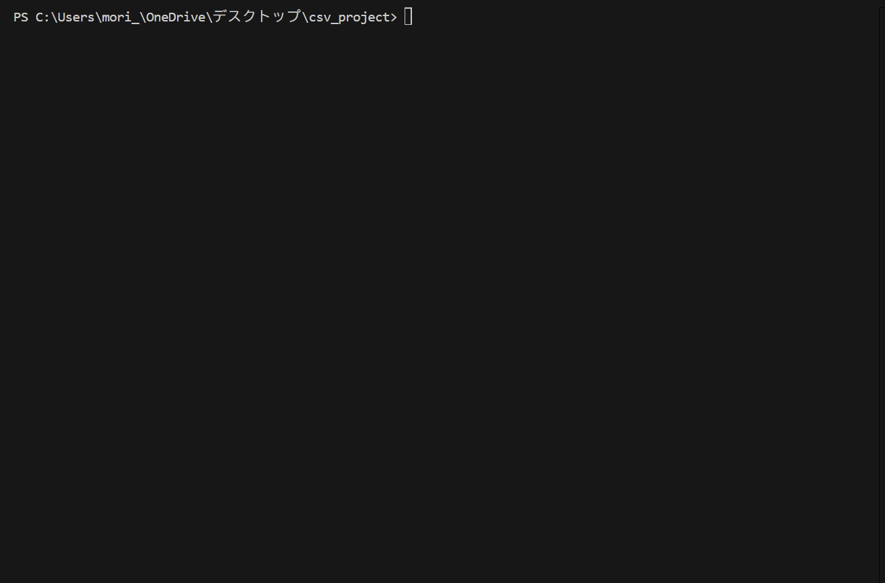

# CATK (CSV Automation Toolkit)

CSV整形・統合・スクレイピングを一気通貫で扱えるツール



---

## ダウンロード
➡️ [最新リリースはこちら](https://github.com/yama-00/catk/releases)

---

## できること
- **clean**: 空白・重複・文字化けを除去
- **report**: 複数CSVを統合し Excel レポート
- **scrape**: Webスクレイピング → CSV 蓄積

---

## 30秒デモの流れ
```bash
# 1) CSV整形
catk clean --in examples/clean_demo/project1.csv --out out/clean.csv

# 2) 複数CSV統合 & Excelレポート
catk report --glob "examples/report_demo/sales_*.csv" --outdir out

# 3) スクレイピング（デモ用 sample.html）
catk scrape --config configs/scrape.yml

# catk
CSV整形・統合・スクレイピングを一気通貫で扱えるツール
>>>>>>> 142cd52587ce47f840e2ca36f8a3627555bb5696
